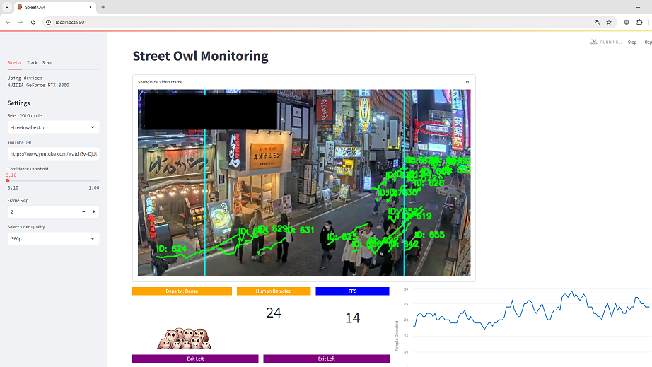



---

## SECTION 1 : PROJECT TITLE
## Street Owl - Insightful analysis for targeted business optimisation

  

---

## SECTION 2 : EXECUTIVE SUMMARY / PAPER ABSTRACT
#### Project Overview  
Retailers, event organisers, and municipal planners often lack tools to analyse street-level crowd patterns, density, and movement in real-time, which could provide valuable insights for optimising operations, marketing, and resource allocation. Although many public spaces are monitored by street-view CCTV systems, these are typically used only for security, leaving their full potential for business and operational insights untapped. Street Owl transforms live video feeds from street-view CCTV into actionable crowd analytics, enabling stakeholders to understand crowd dynamics and respond effectively to on-the-ground conditions.

#### Solution Benefits  
Street Owl provides a unique solution by offering:

1. **Real-time crowd detection and density classification**, allowing retailers and other stakeholders to monitor public foot traffic, peak times, and congestion points outside their premises.
2. **Seamless integration with existing street-view CCTV systems**, avoiding the need for additional equipment and making advanced analytics accessible through current infrastructure.
3. **Actionable, location-based insights** that support smarter decision-making for staffing, marketing efforts, event planning, and public safety, enabling stakeholders to improve both customer engagement and operational efficiency.

#### Market Landscape and Opportunity  
In Singapore’s highly urbanised setting, efficient use of public space and insight into pedestrian flow are essential for both businesses and public safety. With extensive street-level CCTV coverage and constant activity in retail and commercial areas, Singapore provides an ideal environment for Street Owl’s crowd analytics platform. By analysing foot traffic and crowd patterns, the platform enables retailers, event organisers, and city officials to make informed decisions on staffing, marketing, and resource management, enhancing customer experiences and public engagement.

Though tailored for Singapore, Street Owl’s technology is also applicable to other high-density urban areas worldwide, helping stakeholders globally unlock the potential of existing surveillance systems for strategic urban management and improved customer interactions.

#### Conclusion and Future Prospects  
Street Owl aims to broaden its capabilities by integrating with a wider range of surveillance systems and refining its analytics platform. This will support diverse stakeholders in accessing reliable crowd insights from street-view data, ultimately fostering more responsive, data-driven urban spaces.

---

#### SECTION 3 : PROJECT TEAM MEMBERS

| Official Full Name  | Student ID | Email  |
| :------------ |:---------------:| :-----|
| Tan Eng Hui | A0291201W | e1330340@u.nus.edu |
| Hu Lei | A0120681N | e1329735@u.nus.edu |
| Wang Tao | A0291189R | e1330328@u.nus.edu |
| Ho Zi Hao Timothy| A0150123B | e0015027@u.nus.edu |

---

## SECTION 4 : PROJECT REPORT

Refer to [Project Report.pdf](ProjectReport/Project%20Report.pdf) in the **ProjectReport** folder


---

## SECTION 5 : DEPLOYMENT AND USER GUIDE

### User Guide

You can  refer to  **User Guide** at appendix section in [Project Report.pdf](ProjectReport/Project%20Report.pdf). 


### Installation/Deployment Guide

**Prerequisite:**
- Graphic card with CUDA support*  
- Anaconda (python 3.10)  
*Recommended to use GPU, edit the environment.yml according if CUDA GPU is not available  

**Installation and Deployment Instructions:**

1. Navigate to the `SystemCode` folder in the anaconda terminal:
   ```bash
   cd SystemCode
   ```

2. Create the environment with the requirements:
   ```bash
   conda env create -f environment.yml
   ```

3. Activate the Conda environment:
   ```bash
   conda activate torch
   ```

4. [Optional] Setup your OpenAI Key:
   ```bash
   export OPENAI_API_KEY="xxxxxxxxxxxxxxxx"
   ```
   *Note: Only LMM feature that relies on the OpenAI cannot be used without the key.*

5. Launch the Streamlit application:
   ```bash
   streamlit run app.py
   ```

6. Navigate to [http://localhost:8501/](http://localhost:8501/)

---




---
