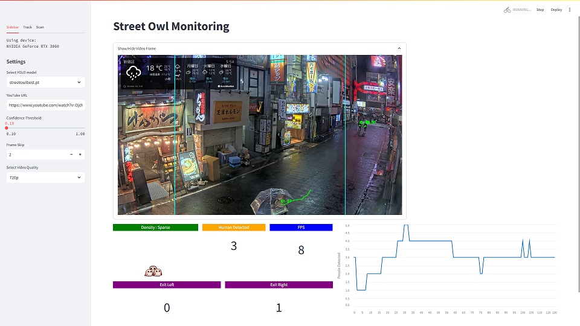

---

## SECTION 1 : PROJECT TITLE
## Street Owl - Insightful analysis for targeted business optimisation

  

---

## SECTION 2 : EXECUTIVE SUMMARY / PAPER ABSTRACT
#### Problem Statement and Proposed Solution 

[Place Holder]

 

#### Differentiation from Existing Markets 

[Place Holder]

 

#### Market Positioning 

[Place Holder]

 

#### Conclusion and Future Prospects 

[Place Holder]

---

## SECTION 3 : CREDITS / PROJECT CONTRIBUTION

| Official Full Name  | Student ID | Work Items | Email  |
| :------------ |:---------------:| :-----| :-----|
| Tan Eng Hui | A0291201W || e1330340@u.nus.edu |
| Hu Lei | A0120681N || e1329735@u.nus.edu |
| Wang Tao | A0291189R || e1330328@u.nus.edu |
| Ho Zi Hao Timothy| A0150123B || e0015027@u.nus.edu |


---

## SECTION 4 : VIDEO OF USE CASE DEMO AND TECHNICAL DESIGN 

| Promo/Demo Video | Technical Design video | 
| :------------: |:---------------:| 
| <a href="#"></a> | <a href="#">  </a> | 


---

## SECTION 5 : PROJECT REPORT

Refer to [Project Report.pdf](ProjectReport/Project%20Report.pdf) in the **ProjectReport** folder


---

## SECTION 6 : DEPLOYMENT AND USER GUIDE

You can also refer to **Installation/Deployment Guide** and **User Guide** respectively at appendix section in [Project Report.pdf](ProjectReport/Project%20Report.pdf). 


### Installation/Deployment Guide

**Prerequisite:**
- Graphic card with CUDA support*  
- Anaconda (python 3.10)  
*Recommended to use GPU, edit the environment.yml according if CUDA GPU is not available  

**Installation and Deployment Instructions:**

1. Navigate to the `SystemCode` folder in the anaconda terminal:
   ```bash
   cd SystemCode
   ```

2. Create the environment with the requirements:
   ```bash
   conda env create -f environment.yml
   ```

3. Activate the Conda environment:
   ```bash
   conda activate torch
   ```

4. [Optional] Setup your OpenAI Key:
   ```bash
   export OPENAI_API_KEY="xxxxxxxxxxxxxxxx"
   ```
   *Note: Only LMM feature that relies on the OpenAI cannot be used without the key.*

5. Launch the Streamlit application:
   ```bash
   streamlit run app.py
   ```

6. Navigate to [http://localhost:8501/](http://localhost:8501/)

---




---
